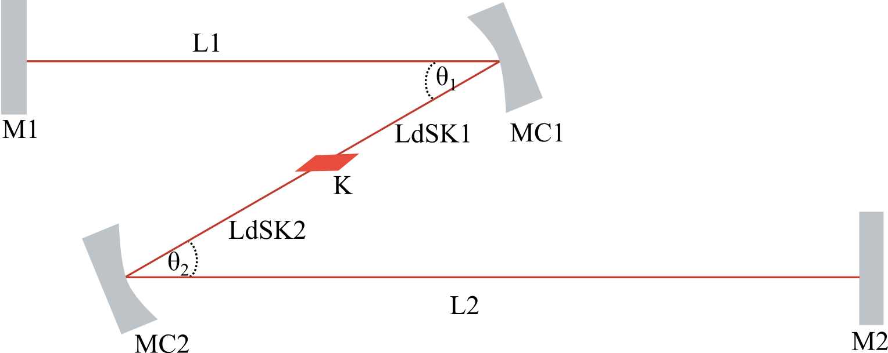
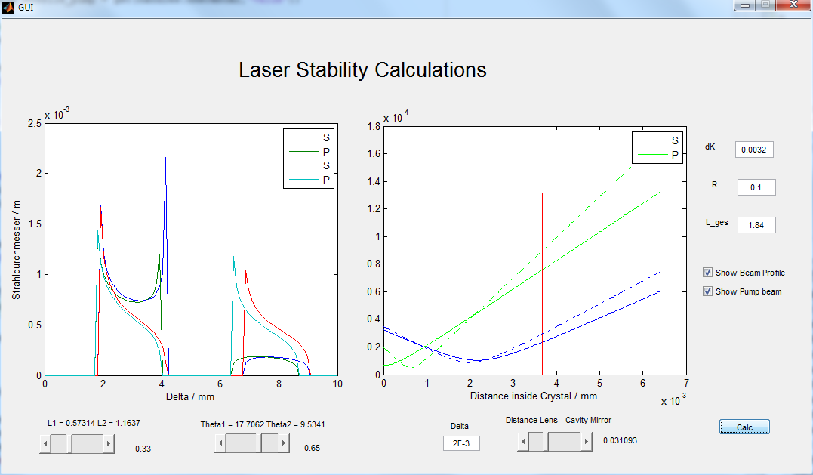
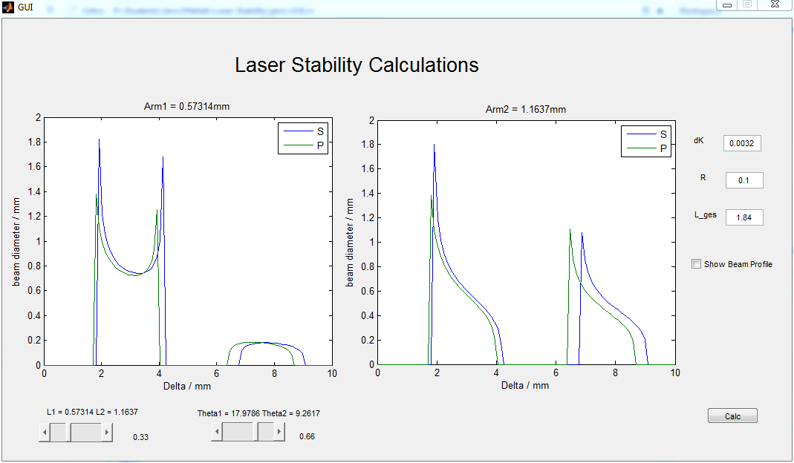

Laser-Resonator-Stability-Calculations
======================================

Calculate stability plots and more for a (TiSa)-Laser-Resonator with the ABCD matrix formalism

Simplified setup:

## Usage
Start one of the following Matlab-files:

* **MAIN_Stabiliy.m**     : Example code for using the Resonator class
* **nd_ndyag_beam_test.m** : Example code to calculate the beam profile of the pump laser inside the crystal
* **GUI.m**               : Start GUI (many parameters like the wavelength etc. are fixed here and need to be changed in the pushbutton function!!!)

## Pics

## TODO

* Improve Code readability (especially in GUI.m)
* More user inpus in GUI
